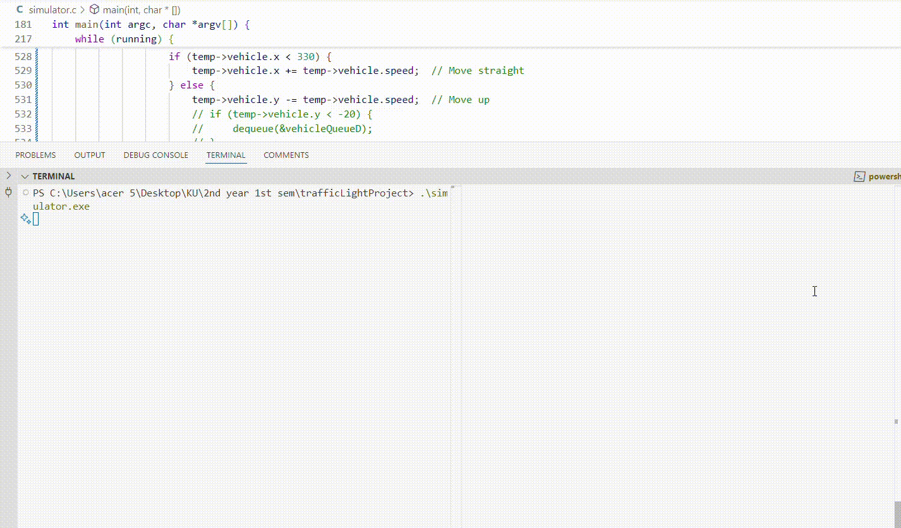

# DSA Queue Simulator

A **Data Structures and Algorithms** project showcasing a queue-based traffic management system, designed to simulate vehicle movement at a busy four-way intersection with **priority lanes** and **free-turn lanes**.



---

## Project Overview

This project simulates a traffic junction where vehicles navigate through an intersection controlled by **traffic lights** and lane-specific rules. The system effectively demonstrates how **linear data structures (queues)** can be applied to solve a real-world traffic management problem.

### Key Functionalities

- **Queue-based Traffic Control**: Each lane’s traffic is managed using a queue to maintain proper vehicle order.
- **Multiple Lane Types**:
    - **Standard Lanes**: Follow normal traffic light rules (stop on red, go on green).
    - **Priority Lane (A2)**: Gains top priority when its queue exceeds 10 vehicles, ensuring faster clearance.
    - **Free-turn Lanes (L3)**: Vehicles here always turn left without waiting for green lights.
- **Adaptive Traffic Light Timing**: Traffic light duration is calculated dynamically based on the vehicle count in each lane.
- **Smooth Vehicle Movement**: Vehicles queue up, move through the junction, and follow turning rules based on lane type.

---

## Implementation Details

The simulator uses **queues and priority queues** to manage vehicles and lanes efficiently.

### Data Structures Used

| Structure         | Purpose |
|------------------|---------|
| **Queue**        | Maintains vehicle order for each lane (FIFO). |
| **Priority Queue**| Controls lane priority, giving Lane A2 higher priority when needed. |
| **Waypoint System** | Guides vehicle movement through the junction. |

### Algorithms

- **Traffic Light Timing Calculation**:
    - `T = |V| * t`
    - Where:
        - `|V|` = Average number of waiting vehicles
        - `t` = Time required for one vehicle to cross
- **Priority Handling**:
    - When Lane A2 accumulates more than **10 vehicles**, it automatically gets top priority.
    - Once Lane A2’s vehicle count drops below **5**, normal rotation resumes.
- **Free Lane Handling**:
    - Vehicles in **L3 lanes** turn left without stopping, regardless of light color.

---

## Prerequisites

To build and run the project, you’ll need:

- **C compatible compiler** (GCC)
- **SDL3 library** (for visualization)

---

## Installing SDL3

Since  is still under development, you may need to build it manually.

## Building the simulator

To build the simulator, run the following command:
```sh
gcc -I C:/SDL3/include -L C:/SDL3/lib -o simulator simulator.c -lSDL3
```
Make sure SDL3 is installed in the above path. This will generate the **simulator.exe** file.

To build the traffic_generator, run the following command:
```sh
gcc traffic_generator.c -o traffic_generator.exe
```
This will generate the **traffic_generator.exe** file.

## Running the Simulator

1. Open two terminal windows.
2. In the first terminal, run the command:
```sh
./simulator.exe
```
3. In the second terminal, run the command:
```sh
./traffic_generator.exe
```